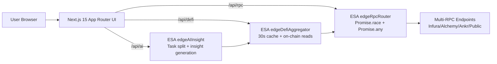

# EdgeWave Nexus — Presentation Script (Judge Demo)

## 0) One-sentence Thesis (10s)

“EdgeWave Nexus fuses **ESA edge acceleration**, **real on-chain reads**, and an **AI insight agent** into one live demo, with measurable latency wins and cinematic 3D visualization.”

## 1) Architecture (60s)

Show this diagram and point out the “edge-first” traffic path:

Call out:
- **Edge Gateway Layer**: `edgeRpcRouter` routes fastest RPC.
- **Data Orchestration Layer**: `edgeDefiAggregator` caches and structures signals.
- **AI Agent Layer**: `edgeAIInsight` transforms signals into narrative.
- **Visualization Layer**: `DefiDataGalaxy` renders a live 3D “DeFi galaxy”.
- **Next.js Layer**: RSC streams server-fetched data into client 3D + chat UI.

## 2) Live Proof #1 — “Edge Sniper” Compare Mode (90s)

Open: `/demo`

Talk track:
1) “Left is baseline: single RPC + simulated server overhead.”
2) “Right is EdgeWave: edge router races multiple RPCs.”
3) Click **Refresh** a few times; highlight:
   - **EdgeWave API latency** drops
   - `x-edgewave-fastest` shows which endpoint won
4) Click **Measure Tx Confirmation (Receipt Lookup)** to demonstrate end-to-end lookup speed.

Key depth line:
- “We combine **Promise.race** (fastest settled) with **Promise.any** (fastest success) to avoid ‘fast failure’ traps.”

## 3) Live Proof #2 — “3D DeFi Galaxy” (90s)

Open: `/` and scroll to **3D DeFi Galaxy**

Talk track:
1) “Each planet is a protocol; size/color/halo respond to live on-chain signals.”
2) Hover: “Inline Html annotations show TVL≈ and volume≈.”
3) Click a planet: “Details panel pins metrics; energy lines visualize cross-protocol flow.”

Key depth line:
- “This is not a canned animation — the scene is data-driven, updated every ~30 seconds.”

## 4) Live Proof #3 — “AI Insight Agent” (90s)

On `/` scroll to **AI Agent Layer**

Ask:
- “Which protocol leads TVL right now?”
- “Compare Uniswap vs Compound momentum in the last minute.”

Explain:
- “UI streams via Vercel AI SDK `useChat`.”
- “Edge function decomposes the question into data tasks, calls the aggregator, then generates a structured report.”
- “If on-edge Transformer inference is not feasible in the ESA environment, we degrade gracefully to a deterministic analysis — the demo remains fully runnable.”

## 5) Closing (20s)

“EdgeWave Nexus is engineered to win on measurable performance, technical depth, and presentation impact: **edge acceleration**, **on-chain data orchestration**, and **AI-driven narrative** — all in one coherent product.”

